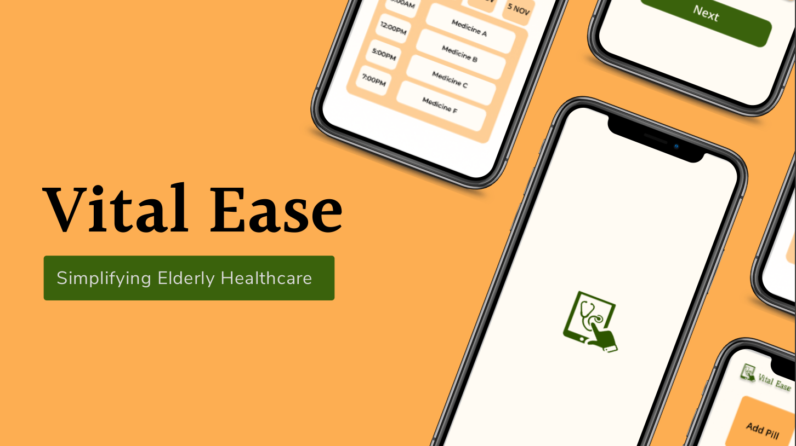

# Vital Ease

*Web Application to Empower Elderly Well-being with Simplified Medication Management.*

## Try it out

🌐 See a **live demo** [here](https://vital-ease.vercel.app/).

## Introduction

Managing medication schedules can be challenging for the elderly due to various factors such as complex regimens and potential memory issues. 

Vital Ease attempts to solve this problem by providing a simple, easy-to-use web application that helps the elderly manage their medication schedules and keep track of their health vitals.

## Tech Stack

* React (as the frontend framework)
* Tailwind (for styling the frontend)
* Vite (for building the frontend)
* React Router (for routing)

## List of Features

### Medication Management

* Easily manage prescription regimens.
* Schedule and track medication intake.

### Emergency Contacts

* Store and access emergency contacts.

### Multi-language Support

* Provide support for multiple languages.

### User-Centric Design

* Simple and easy-to-use interface.
* Large text and buttons for easy readability.
* High contrast for easy visibility.

### Remote Monitoring

* Allow caregivers to remotely monitor the health vitals of the elderly.

## Links

* [User Interview Notes](https://docs.google.com/document/d/1wHhd4eff2fMpHGzTY11gyzBJ_PEju29U/edit?usp=sharing&ouid=106758123571067630847&rtpof=true&sd=true)
* [FigJam Link - Interview notes, user journey map, user flow diagram, wireframe](https://www.figma.com/file/NrDHMN1WuRdKLuYKMGJrrL/VitalEase-Figjam?type=whiteboard&t=ojaQi6IqFW5HqmaT-1)
* [Figma Link - High fidelity wireframes, Final Design and the Prototype](https://www.figma.com/file/Yl7yBYO7DfEWiLJJTBn5xx/VitalEase-app?type=design&mode=design&t=ojaQi6IqFW5HqmaT-1)
* [Design Presentation](https://drive.google.com/file/d/1kRFB1nWA-sPUIbKIBQfl5U-NGYYw6KvT/view?usp=sharing)
* [Final Presentation](https://drive.google.com/file/d/1_hyAXXdCLCTZNEmfv4DYNj1N6iSGaGaa/view?usp=sharing)
* [Live Demo](https://vital-ease.vercel.app/)

## Contributors

* [Lenin Kennedy](https://github.com/lem0n4id)
* [Kadambini Trivedi](https://github.com/Kadambini30)
* [Shailee Yadav](https://www.linkedin.com/in/shailee-yadav-511a1b224/s)
* [Leenasowmithra Sairajaganesh](https://www.linkedin.com/in/leenasowmithra-sairajaganesh-7858a4243/)
* [Akruti Somkuwar](https://www.linkedin.com/in/akruti-s-961399195/)
